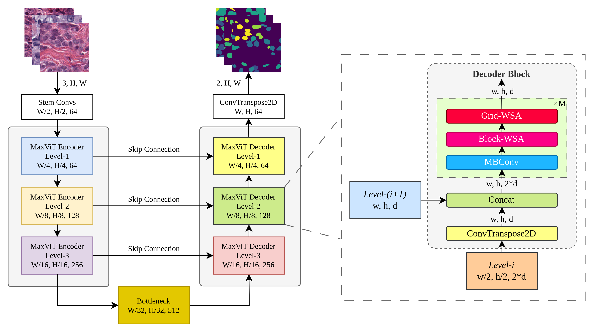
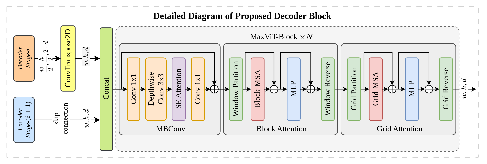
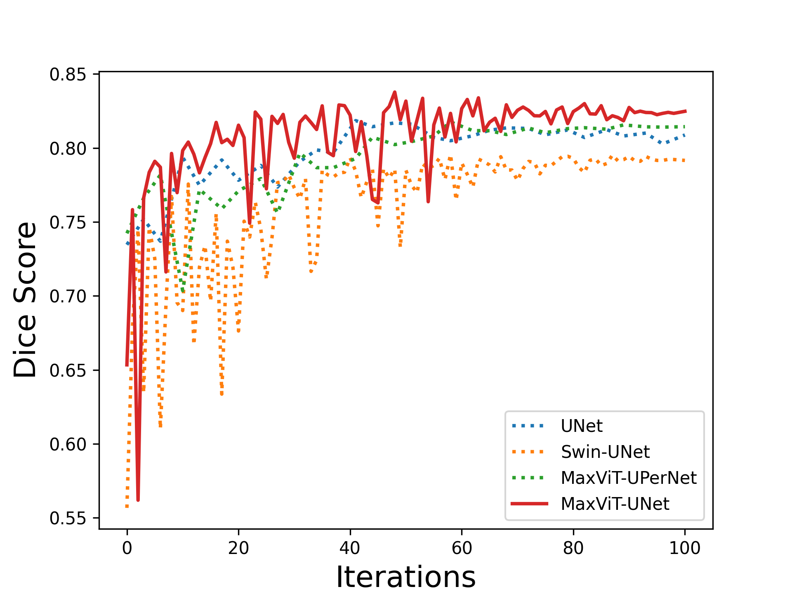
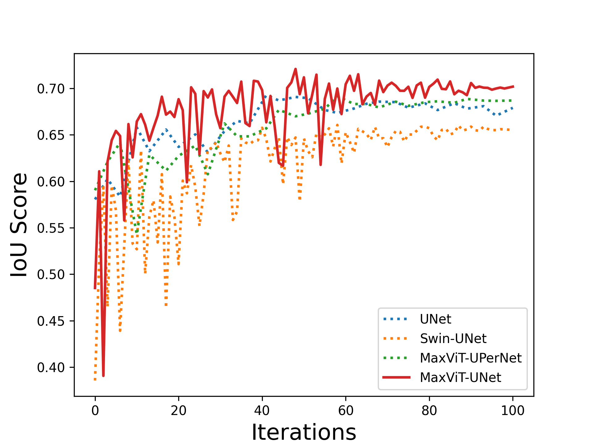

# MaxViT-UNet: Multi-Axis Attention for Medical Image Segmentation

## Abstract
Convolutional neural networks have made significant strides in medical image analysis in recent years. However, the local nature of the convolution operator inhibits the CNNs from capturing global and long-range interactions. Recently, Transformers have gained popularity in the computer vision community and also medical image segmentation. But scalability issues of self-attention mechanism and lack of the CNN like inductive bias have limited their adoption. In this work, we present MaxViT-UNet, an Encoder-Decoder based hybrid vision transformer for medical image segmentation. The proposed hybrid decoder, also based on MaxViT-block, is designed to harness the power of convolution and self-attention mechanism at each decoding stage with minimal computational burden. The multi-axis self-attention in each decoder stage helps in differentiating between the object and background regions much more efficiently. The hybrid decoder block initially fuses the lower level features upsampled via transpose convolution, with skip-connection features coming from hybrid encoder, then fused features are refined using multi-axis attention mechanism. The proposed decoder block is repeated multiple times to accurately segment the nuclei regions. Experimental results on MoNuSeg dataset proves the effectiveness of the proposed technique. Our MaxViT-UNet outperformed the previous CNN only (UNet) and Transformer only (Swin-UNet) techniques by a large margin of 2.36% and 5.31% on Dice metric respectively. ([arxiv](https://arxiv.org/abs/2305.08396))

<div align="center">
  
</div>
<div align="center">
  
</div>

## Installation

Important versions:
```shell
python==3.10.4
cudatoolkit==11.3.1
pytorch==1.12.1
torchvision==0.13.1
timm==0.6.12
openmim==0.2.1
mmcls==0.23.2
mmcv-full==1.6.0
mmsegmentation==0.24.1
```

Complete environment information is in [environment.yml](environment.yml) file

**Step 0.** Download and install Miniconda from the [official website](https://docs.conda.io/en/latest/miniconda.html).

**Step 1.** Create a conda environment and activate it.

```shell
conda create --name openmmlab python=3.10.4 -y
conda activate openmmlab
```

**Step 2.** Install [PyTorch](https://pytorch.org) using following command.
```shell
conda install pytorch==1.12.1 torchvision==0.13.1 torchaudio==0.12.1 cudatoolkit=11.3 -c pytorch
```

**Step 3.** Install [MMCV](https://github.com/open-mmlab/mmcv) using [MIM](https://github.com/open-mmlab/mim).

```shell
pip3 install -U openmim
mim install mmcv-full
```

**Step 4.** Clone this repository.
```shell
git clone https://github.com/abdul2706/maxvit_unet.git
cd maxvit_unet
pip3 install -v -e .
```

For more details refer to [get_started.md](docs/en/get_started.md) by MMSegmentation.

## Data
Refer to the [MoNuSeg18](https://monuseg.grand-challenge.org/Data/) for dataset related information. To prepare dataset in MMSegmentation style format see [dataset_prepare.md](docs/en/dataset_prepare.md).

## Training
Before training MaxViT-UNet, change the value of `MMSEG_HOME_PATH`, and `DATASET_HOME_PATH` in the [config](configs/maxvit_unet/maxvit_unet_s1.py) file. Then use following commands:
```shell
# single-gpu training
python3 tools/train.py "configs/maxvit_unet/maxvit_unet_s1.py"

# multi-gpu training
CUDA_VISIBLE_DEVICES=0,1,2,3 PORT=29500 tools/dist_train.sh "configs/maxvit_unet/maxvit_unet_s1.py" 4
```

## Inference
```shell
# single-gpu testing
python tools/test.py "configs/maxvit_unet/maxvit_unet_s1.py" "path/to/checkpoint.pth" --eval mDice

# multi-gpu testing
tools/dist_test.sh "configs/maxvit_unet/maxvit_unet_s1.py" "path/to/checkpoint.pth" <GPU_NUM> --eval mDice
```

## Results

  | Model | Dice | IoU |
  | ----- | ---- | --- |
  |UNet | 0.8185 | 0.6927 |
  |Swin-UNet | 0.7956 | 0.6471 |
  |MaxViT-UPerNet | 0.8176 | 0.6914 |
  |MaxViT-UNet | 0.8378 | 0.7208 |

MaxViT-UNet weights trained on MoNuSeg18 can be downloaded from [here](https://drive.google.com/file/d/111D2K5TMh-gAG5ycN8VB2lxjXGGoiY79/view?usp=share_link).

---

Comparison Curves

  | | | |
  | - | - | - |
  | <div align="center"></div> | <div align="center"></div> |

## Qualitative Comparison

<div align="center">
  
</div>

## Citation

```
@misc{rehman2023maxvitunet,
      title={MaxViT-UNet: Multi-Axis Attention for Medical Image Segmentation}, 
      author={Abdul Rehman and Asifullah Khan},
      year={2023},
      eprint={2305.08396},
      archivePrefix={arXiv},
      primaryClass={eess.IV}
}
```
